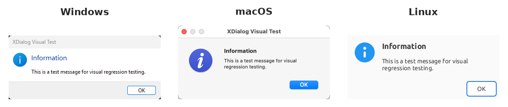
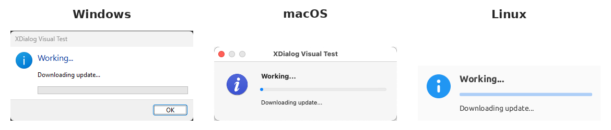

# xdialog
[](https://crates.io/crates/xdialog)
[](https://github.com/velopack/xdialog/blob/master/LICENSE)

A cross-platform library for displaying native dialogs in Rust. On Windows and macOS, this
library uses native system dialogs (Win32 TaskDialog and AppKit). On Linux, the default backend
is a pure Rust software renderer (winit + tiny-skia) with no C/C++ build dependencies, making it
fully compatible with static musl builds. Optional GTK3 and FLTK backends are available via
feature flags. This allows for a simplified API and consistent behavior across platforms.

This is not a replacement for a proper GUI framework. It is meant to be used for CLI / background
applications which occasionally need to show dialogs (such as alerts, or progress) to the user.

It's main use-case is for the [Velopack](https://velopack.io) application installation and
update framework.

## Features
- Cross-platform: works on Windows, macOS, and Linux
- Native backends on Windows (Win32) and macOS (AppKit) with zero additional build dependencies
- Pure Rust software-rendered backend on Linux (no C/C++ dependencies, static musl compatible)
- Optional GTK3 and FLTK backends on Linux via feature flags
- Embedded font (Liberation Sans) - no system font dependencies on Linux
- Simple and consistent API across all platforms

## Installation

Add the following to your `Cargo.toml`:
```toml
[dependencies]
xdialog = "0" # replace with the latest version
```

Or, run the following command:
```sh
cargo install xdialog
```

## Usage
Since some platforms require UI to be run on the main thread, xdialog expects to own the
main thread, and will launch your core application logic in another thread.

```rust
use xdialog::*;

fn main() -> i32 {
  XDialogBuilder::new().run(your_main_logic)
}

fn your_main_logic() -> i32 {

  // ... do something here

  let should_update_now = show_message_yes_no(
    "My App Incorporated",
    "New version available",
    "Would you like to to the new version now?",
    XDialogIcon::Warning,
  ).unwrap();

  if !should_update_now {
    return -1; // user declined the dialog
  }

  // ... do something here

  let progress = show_progress(
    "My App Incorporated",
    "Main instruction",
    "Body text",
    XDialogIcon::Information
  ).unwrap();

  progress.set_value(0.5).unwrap();
  progress.set_text("Extracting...").unwrap();
  std::thread::sleep(std::time::Duration::from_secs(3));

  progress.set_value(1.0).unwrap();
  progress.set_text("Updating...").unwrap();
  std::thread::sleep(std::time::Duration::from_secs(3));

  progress.set_indeterminate().unwrap();
  progress.set_text("Wrapping Up...").unwrap();
  std::thread::sleep(std::time::Duration::from_secs(3));

  progress.close().unwrap();
  0 // return exit code
}
```

There are more examples in the `examples` directory.
```sh
cargo run --example various_options
```

## Dialog Types

xdialog renders the same dialog API as native-feeling windows on each platform.
The screenshots below were captured by the visual regression tests in `tests/`.

### Message Box



A message box shows a single piece of information with an icon and one or
more buttons (e.g. OK, Yes/No). It blocks until the user dismisses it and
returns the user's choice. Use it for alerts, confirmations, and errors.

```rust
use xdialog::*;

let should_update = show_message_yes_no(
    "My App Incorporated",
    "New version available",
    "Would you like to update to the new version now?",
    XDialogIcon::Warning,
).unwrap();
```

### Progress Dialog



A progress dialog reports the status of a long-running operation. It is
non-blocking: `show_progress` returns a handle that the caller updates from
its worker thread to change the message and progress bar value, switch to
indeterminate mode, or close the dialog when the work is finished.

```rust
use xdialog::*;

let progress = show_progress(
    "My App Incorporated",
    "Working...",
    "Downloading update...",
    XDialogIcon::Information,
).unwrap();

progress.set_value(0.5).unwrap();
progress.set_text("Extracting...").unwrap();

progress.set_indeterminate().unwrap();
progress.set_text("Wrapping up...").unwrap();

progress.close().unwrap();
```

## Backends
- **Windows**: Native Win32 TaskDialog API
- **macOS**: Native AppKit dialogs
- **Linux** (default): Pure Rust software renderer using winit + tiny-skia + fontdue. No C/C++ build
  dependencies, works with static musl linking, and embeds its own font.
- **Linux** (`gtk` feature): GTK3 backend. Requires `libgtk-3-dev` on Debian/Ubuntu. When enabled,
  GTK3 becomes the default backend with automatic fallback to the software renderer if GTK fails
  to initialize.
- **Linux** (`fltk` feature): [fltk-rs](https://github.com/fltk-rs/fltk-rs) backend. Requires
  cmake and X11/Wayland development libraries. Must be explicitly selected via
  `XDialogBuilder::new().with_backend(XDialogBackend::Fltk)`.

```toml
# Default (pure Rust, no extra dependencies)
[dependencies]
xdialog = "0"

# With GTK3 support
[dependencies]
xdialog = { version = "0", features = ["gtk"] }

# With FLTK support
[dependencies]
xdialog = { version = "0", features = ["fltk"] }
```
